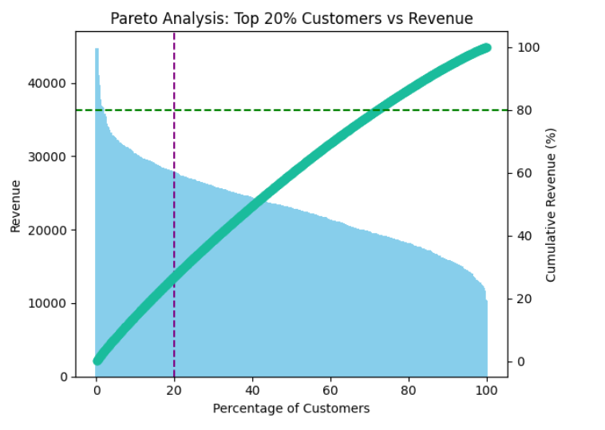
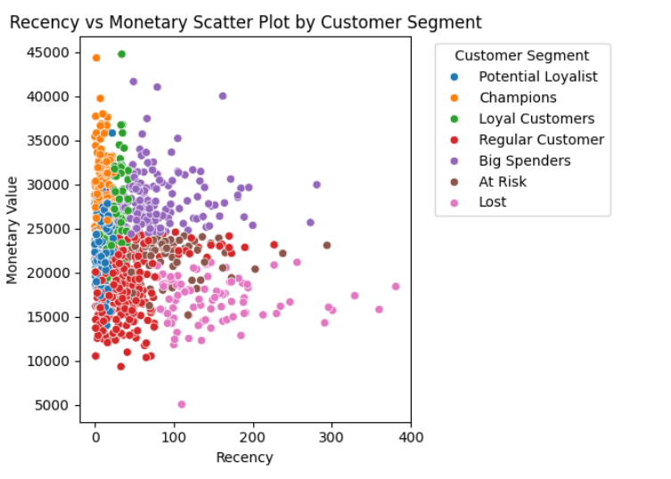
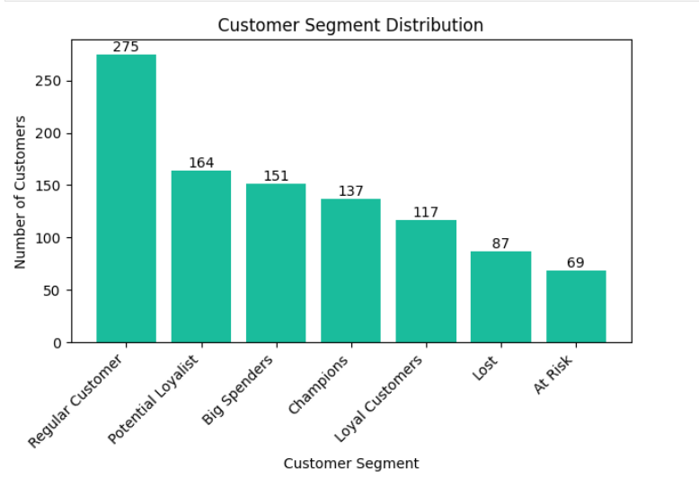
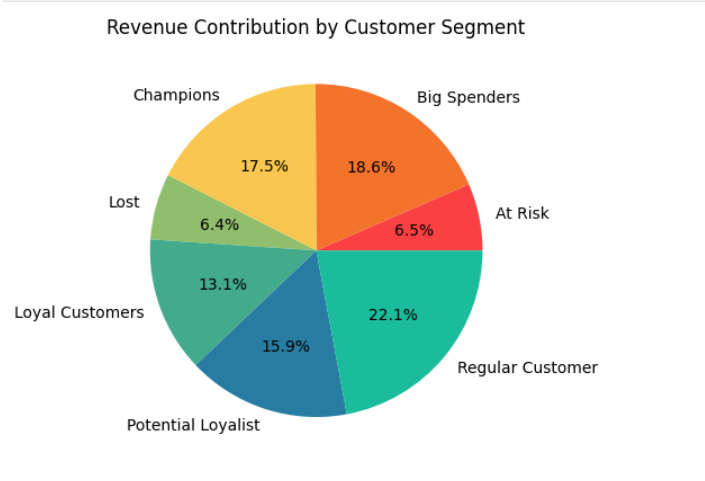

# Customer Data Analysis using Python

This project focuses on analyzing customer behavior and revenue patterns using data analytics techniques.  
The goal is to identify high-value customers, understand customer segmentation, and generate business insights using data visualization.

---

## Project Objectives

- Identify top revenue-generating customers
- Perform RFM (Recency, Frequency, Monetary) segmentation
- Analyze customer contribution to overall revenue
- Provide business insights through visual analytics

---

## Key Insights Preview

### Pareto Analysis – Top Customers vs Revenue
This analysis shows that a small percentage of customers contribute to a large portion of total revenue, following the 80/20 rule.

---

### Customer Segmentation (RFM Analysis)
Customers are segmented based on Recency and Monetary value to understand purchasing behavior and customer importance.

---

### Customer Segment Distribution
This visualization shows the number of customers present in each segment category.

---

### Revenue Contribution by Segment
This chart highlights how different customer groups contribute to total revenue.

## Tools & Technologies Used

- Python
- Pandas
- NumPy
- Matplotlib
- Data Visualization
- Jupyter Notebook

---

## Business Insights

- A small group of customers generates a significant portion of revenue.
- Loyal and Champion customers represent high business value.
- At-risk customers require retention strategies.
- Customer segmentation helps businesses design targeted marketing strategies.

---

## Author

**Rajeshwari Patel**  
Data Analyst | Agriculture Graduate transitioning into Data Analytics