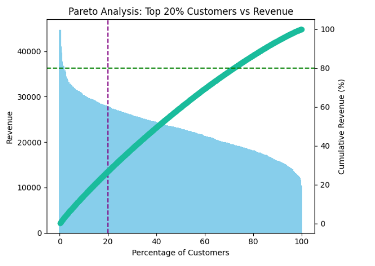
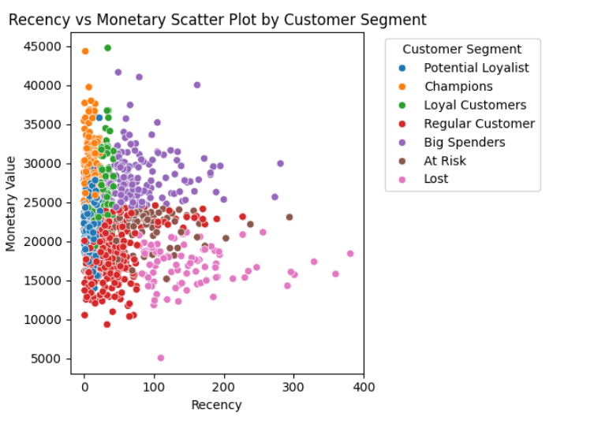
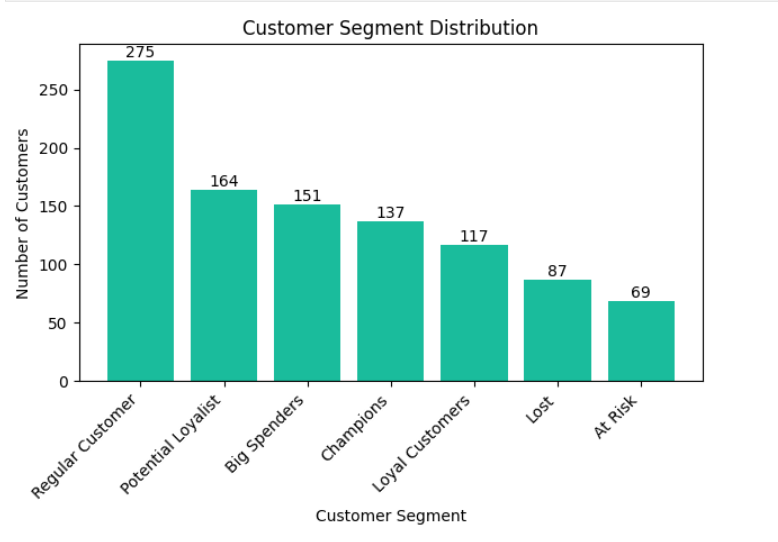
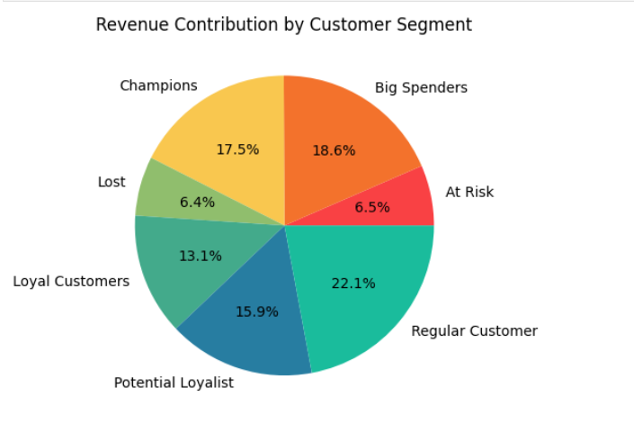

# Customer Data Analysis – Business Insights using Python

## 1. Project Overview

This project analyzes customer purchasing behavior using data analytics techniques to uncover insights that can help businesses improve marketing strategies and revenue generation.

Using Python-based exploratory data analysis, the study focuses on identifying high-value customers, understanding purchasing patterns, and segmenting customers based on their transaction behavior.

The analysis provides insights into how businesses can better understand their customer base and design targeted engagement strategies.

---

## 2. Dataset Description

This project uses a synthetic retail dataset containing **23,050 transactions made by 1,000 unique customers**.

The dataset is structured into two related tables to simulate a real-world retail database environment.

---

### 2.1 Customer Master Data

This dataset contains demographic and profile information for each customer.

| Column Name | Description |
|-------------|-------------|
| CustomerID | Unique identifier for each customer |
| Name | Customer's full name |
| Email | Customer's email address |
| Gender | Male, Female, or Not Disclosed |
| Age | Customer age (between 18 and 75) |
| City | City where the customer resides |
| MaritalStatus | Single, Married, Divorced, Widowed |
| NumChildren | Number of children in the household |
| JoinDate | Date when the customer first registered |

---

### 2.2 Transaction Data

This dataset contains purchase transactions made by customers.

| Column Name | Description |
|-------------|-------------|
| CustomerID | Links transaction to the customer master dataset |
| TransactionDate | Date when the transaction occurred |
| TransactionAmount | Amount spent in the transaction (₹) |

The relational structure between these datasets allows analysis of purchasing patterns, customer value, and revenue contribution.

---

## 3. Data Preparation & Processing

Before performing the analysis, several preprocessing steps were conducted to ensure data quality and consistency:

- Verified dataset structure and variable types
- Checked for missing or inconsistent values
- Merged customer and transaction datasets
- Calculated customer-level metrics required for RFM analysis
- Prepared aggregated transaction data for revenue analysis

After preprocessing, the dataset was ready for exploratory data analysis.

---

## 4. Exploratory Data Analysis (EDA)

Exploratory analysis was conducted to understand customer purchasing behavior and revenue distribution.

### 4.1 Pareto Analysis – Revenue Distribution

A Pareto analysis was performed to examine the distribution of revenue across customers.

The results demonstrate the **80/20 principle**, where a small proportion of customers contributes to a large share of total revenue.

---

### 4.2 RFM Customer Segmentation

Customers were segmented using the **RFM (Recency, Frequency, Monetary)** framework.

- **Recency:** Time since the customer's last purchase  
- **Frequency:** Number of transactions made by the customer  
- **Monetary:** Total revenue generated by the customer  

This segmentation helps identify valuable customers and understand purchasing engagement.

---

### 4.3 Customer Segment Distribution

This visualization illustrates how customers are distributed across different RFM segments.

---

### 4.4 Revenue Contribution by Segment

This chart highlights how different customer segments contribute to total revenue.

---

## 5. Key Business Insights

The analysis produced several valuable insights regarding customer behavior:

- A small percentage of customers generate a large portion of overall revenue.
- **Champion and Loyal customers** contribute significantly to business value.
- **At-risk customers** represent an important group for retention efforts.
- Customer segmentation enables more effective targeting and personalized marketing strategies.

---

## 6. Business Recommendations

Based on the analysis, the following strategies are recommended:

1. Focus on retaining **high-value customers** to maintain stable revenue streams.
2. Develop **loyalty programs** for frequent buyers to increase customer lifetime value.
3. Implement **targeted marketing campaigns** tailored to different customer segments.
4. Design **re-engagement strategies** for at-risk customers to reduce churn.

---

## 7. Tools & Technologies Used

- Python  
- Pandas  
- NumPy  
- Matplotlib  
- Jupyter Notebook  
- Data Visualization  

---

## 8. Conclusion

This project demonstrates how exploratory data analysis can uncover valuable insights about customer purchasing behavior and revenue patterns.

Using RFM segmentation and Pareto analysis, businesses can better understand their customer base and implement data-driven marketing and retention strategies.

---

## 9. Scope for Future Work

Future improvements to this project may include:

- Incorporating demographic and geographic customer data
- Performing time-series analysis of customer purchasing patterns
- Building predictive models for customer lifetime value
- Developing interactive dashboards for business monitoring

---

## Author

**Rajeshwari Patel**  
Aspiring Data Analyst | Agriculture Graduate transitioning into Data Analytics
